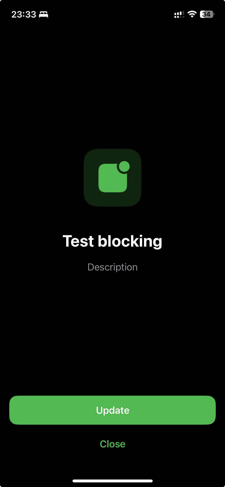

# PizzaBlockingScreen



## Usage

Use `PizzaBlockingScreenController` with two params on initialization:
- model
- delegate

## JSON model example

```json
[
  {
    "id": "new_version_ru",
    "title": "Новая версия |X|",
    "desc": "Пожалуйста, обновите приложение до последней версии",
    "closeButtonName": "Позже",
    "icon": {
      "appIconName": "AppIcon"
    },
    "button": {
      "title": "Обновить",
      "actionContext": {
        "url": "https://apps.apple.com/ru/app/whatsx/id123",
        "closeAfterOpeningURL": true
      }
    },
    "requirements": {
      "version": "100.0.0",
      "versionRequirementType": ">=",
      "languageCode": "ru"
    },
    "nextLaunchOpenPolicy": "openEveryTime"
  },
  {
    "id": "new_version_en",
    "title": "Update |X|",
    "desc": "A new version of the app is available",
    "closeButtonName": "Later",
    "icon": {
      "sfSymbol": "gearshape.arrow.triangle.2.circlepath",
      "assetName": null
    },
    "button": {
      "title": "Update",
      "actionContext": {
        "url": "https://apps.apple.com/ru/app/whatsx/id123",
        "closeAfterOpeningURL": true
      }
    },
    "requirements": {
      "version": "100.0.0",
      "versionRequirementType": ">="
    },
    "nextLaunchOpenPolicy": "openEveryTime"
  }
]
```
