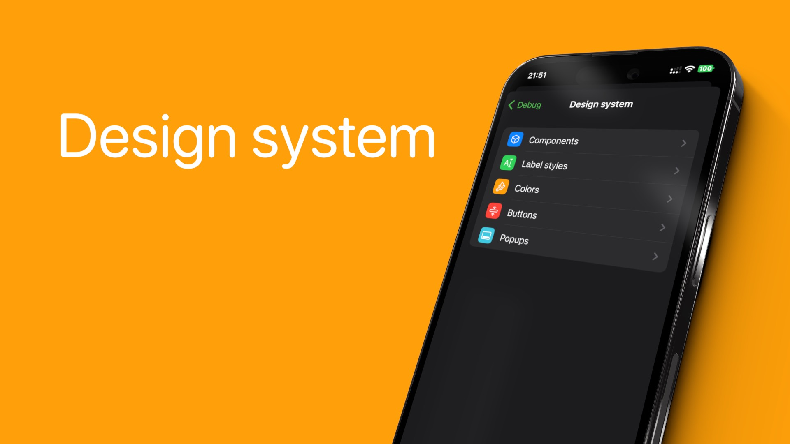
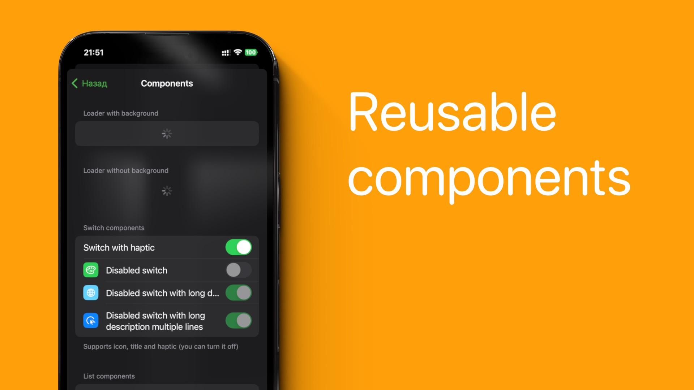
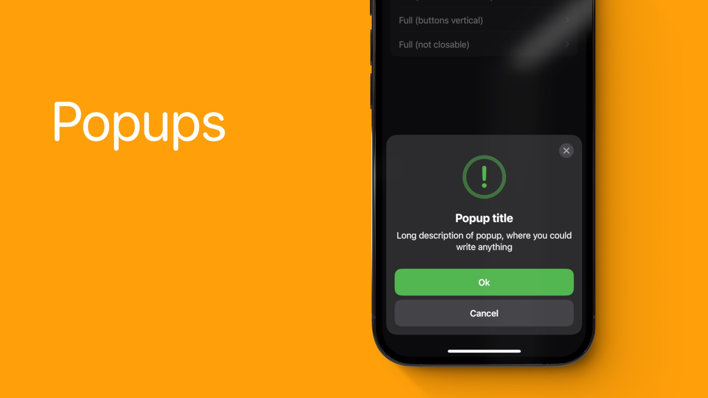
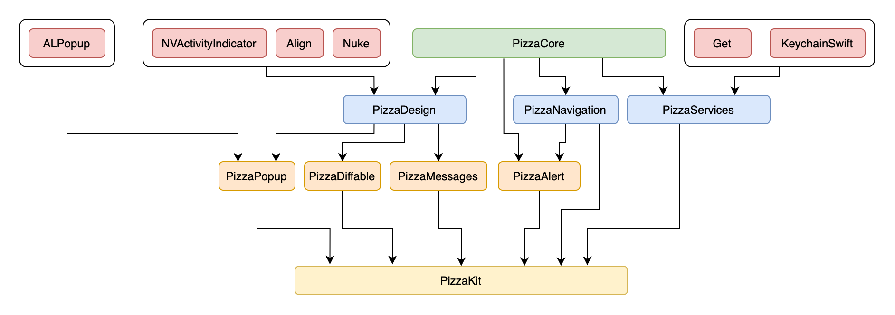

# PizzaKit


This is repository with reusable parts of app.

## Overview





## Modules



## PizzaCore

- Types Provide some default typealias for simplifying working with closures.
- `.do` extension
- Functional - Define custom functional operator `~>` for working with optionals values.
- Extensions - Some extensions for common Swift classes and UIKit classes.
- `StringBuilder` - working with `NSAttributedString`
- `PizzaVersion` - working with version string
- `StringUtils`
  - rounding and formatting `Int` values to human readable format (10 100 000 becomes 10M)
  - formatting duration in seconds in string with ':' delimeter

## PizzaDesign

- Base classes for controller/label/view
- Design system with label/button styles and color palette
- Reusable flexible solution for Icons (`PizzaIcon`)
- `PizzaTeaserView` - view for error/empty states
- `PizzaPressableView` - view for handling press/touch

## PizzaNavigation

- Coordinator
- Router
- RootController - for smooth transitions between root controllers

## Pizza Services

- `AnalyticsDebugService` - show/hide view over the app
- `PizzaAppThemeService` - changing app theme (light/dark + accentColor)
- Crypto - encrypt/decrypt + verify signature
- `PizzaDefaultsService` - convinient working with UserDefaults
- `PizzaDeveloperModeService` - service for enabling/disabling developer mode
- feature toggles service
- logger
- service for sending mail from the app
- `PizzaProVersionService` / `PizzaProVersionDebugService` - working with pro mode
- `PizzaPushNotificationsPermissionHelper` - helper for getting state of push notifications in the app
- `PizzaUUID` - getting unique identifier of device
- `PizzaCoreDataService` - working with CoreData

## PizzaComponents

Module for working with screens like forms (settings, infos).

You can use ready components:
- ListComponent
- SwitchComponent
- AppInfoComponent
- ComponentIcon
- LoadingComponent
- PizzaButtonComponent
- TitleComponent
- TextFieldComponent

Or you can create your own component.

## PizzaPopup

Open poups with ease.

## PizzaAlert

Module for easily open alerts.
Have it's own optional configuration `PizzaAlertConfiguration`.

```swift
PizzaAlert()
    .title("Some title")
    .description("Some description")
    .add(actions: [
        .default("Ok").setPreferred(),
        .cancel()
    ])
    .build()
    .show()
```
