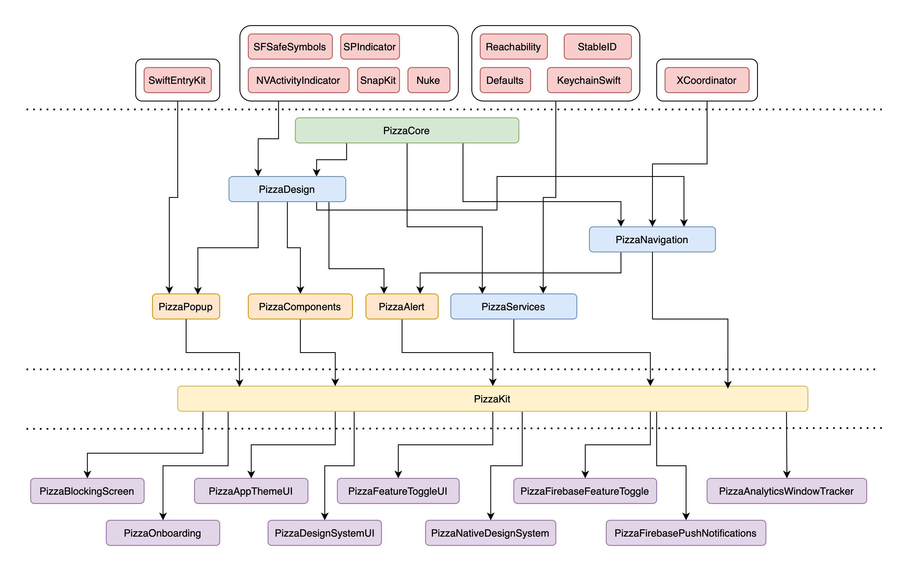

# PizzaKit


## Modules



## Configuration

Almost each module have it's own configuration. Some of configs are optional while others are obligatory. 

## PizzaCore

### Types

Provide some default typealias for simplifying working with closures.

### Functional

Define custom functional operator `~>` for working with optionals values.

### Extensions

Some extensions for common Swift classes and UIKit classes.

### StringUtils

Enitity for some string manipulations such as:

- rounding and formatting `Int` values to human readable format (10 100 000 becomes 10M)
- formatting duration in seconds in string with ':' delimeter

## PizzaAlert

Module for easily open alerts.
Have it's own optional configuration `PizzaAlertConfiguration`.

```swift
PizzaAlert()
    .title("Some title")
    .description("Some description")
    .add(actions: [
        .default("Ok").setPreferred(),
        .cancel()
    ])
    .build()
    .show()
```
